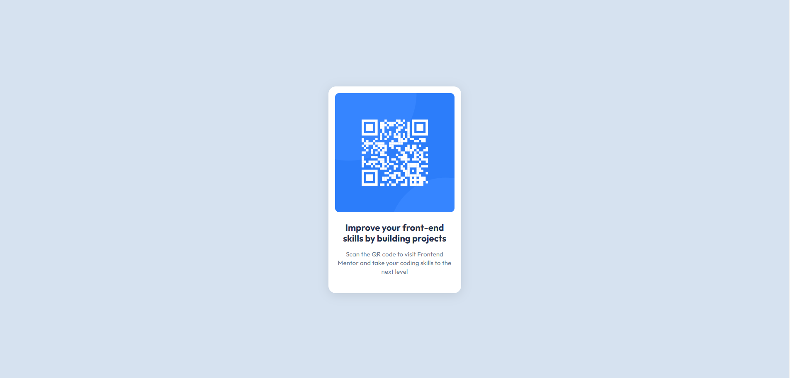

# Frontend Mentor - QR code component solution

This is a solution to the [QR code component challenge on Frontend Mentor](https://www.frontendmentor.io/challenges/qr-code-component-iux_sIO_H). Frontend Mentor challenges help you improve your coding skills by building realistic projects. 

## Table of contents

- [Overview](#overview)
  - [Screenshot](#screenshot)
  - [Links](#links)
- [My process](#my-process)
  - [Built with](#built-with)
  - [Continued development](#continued-development)
  
- [Author](#author)

## Overview

### Screenshot

### Links

- Live Site URL: (https://ericssonmura.github.io/01-frontend-mentor-qr-code-component/)

## My process

### Built with

- Semantic HTML5 markup
- CSS custom properties
- (A tiny bit of) Flexbox

### Continued development

I'd like to learn how to make this qr-code responsive. And get suggestions on my code.

## Author

Frontend Mentor - [@ericssonmura](https://www.frontendmentor.io/profile/ericssonmura)

